<div align="center">

# Mago: A Ascensão — Ficha de Personagem

**Ficha de personagem offline para Mago: A Ascensão (Edição 20º Aniversário),
com as regras de criação cobradas pelo app.**

Flutter · Android · PWA · 100% offline · sem conta, sem servidor

[**▶ Abrir no navegador**](https://gabesilvadev.github.io/mago-ficha/) ·
[Instalar](#instalar) · [Como foi feito](#como-foi-feito)

</div>

---

## O problema

Ficha de Mago 20ª tem **duas páginas densas** e uma criação cheia de regras que
não perdoam: a distribuição fixa dos Atributos, as três colunas de Habilidades
com orçamentos diferentes, o limite de iniciante nas Esferas, o equilíbrio entre
Qualidades e Defeitos e os 15 pontos de bônus no fim. Na mesa, sempre alguém
distribui errado e só descobre três sessões depois.

A ideia aqui foi simples: **o app cobra as regras enquanto você cria**, e depois
sai da frente enquanto você joga.

<div align="center">
  
</div>

---

## Criação: 7 passos, cada um travado até fechar

O botão **Próximo** só habilita quando a etapa está exatamente certa. Nada de
salvar uma ficha ilegal e descobrir depois.

<table>
<tr>
<td width="33%" valign="top">

**1 · Identidade**

Natureza e Comportamento (20 cada), Essência, Afiliação → Facção em cascata e
Conceito com sugestões. Tudo obrigatório, menos a Crônica.

</td>
<td width="33%" valign="top">

**Seletores em modal**

Toda escolha abre uma lista rolável. **Segure o dedo** em qualquer opção para ler
a descrição da regra — o livro inteiro está nos tooltips.

</td>
<td width="33%" valign="top">

**2 · Atributos**

Distribuição fixa **4-3-3-3-2-2-2-2-1**. Os chips contam ao vivo: vermelho
quando estoura, verde quando fecha.

</td>
</tr>
<tr>
<td>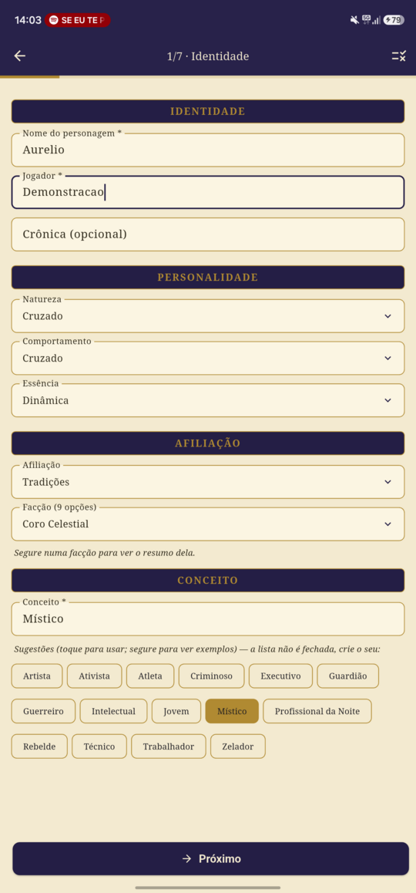</td>
<td>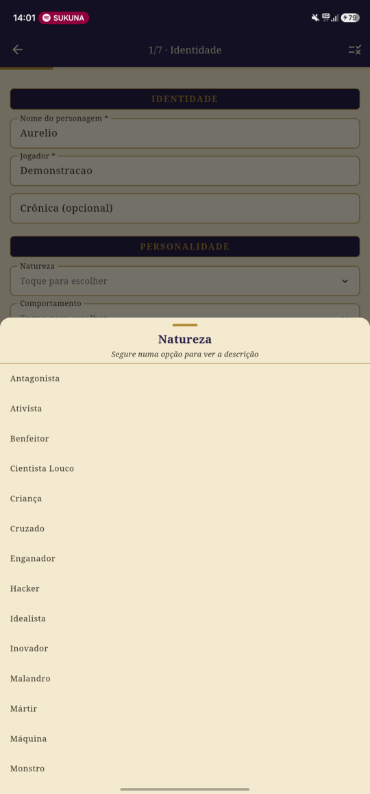</td>
<td>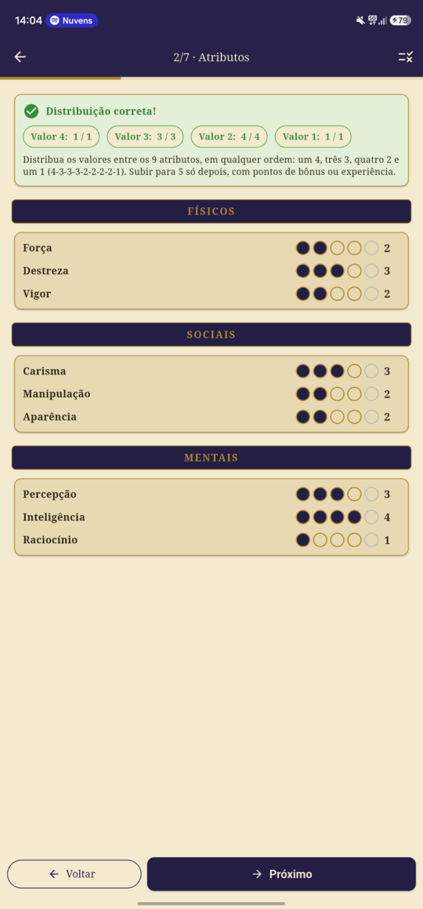</td>
</tr>

<tr>
<td valign="top">

**3 · Habilidades**

Três colunas por prioridade: **Principal 15 pts + 2 especializações ·
Secundário 11 + 1 · Terciário 9 + 0**. Máximo 3 na criação. Cada coluna aceita
**Habilidade personalizada**, para as opcionais do livro que não cabem na ficha
padrão.

</td>
<td valign="top">

**4 · Esferas**

6 pontos livres, teto de 3 por Esfera, e a Afinidade sai da Facção — o
Ahl-i-Batin, por exemplo, simplesmente não aprende Entropia. O checklist mostra
o que ainda falta.

</td>
<td valign="top">

**5 · Vantagens & Defeitos**

Antecedentes (33) + Qualidades (9) somam os positivos; os Defeitos (8) precisam
empatar com eles. Máximo 4 de cada categoria, e o Avatar define a Quintessência
inicial.

</td>
</tr>
<tr>
<td>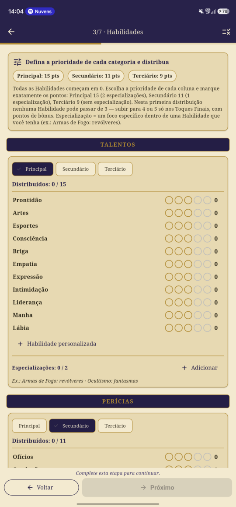</td>
<td>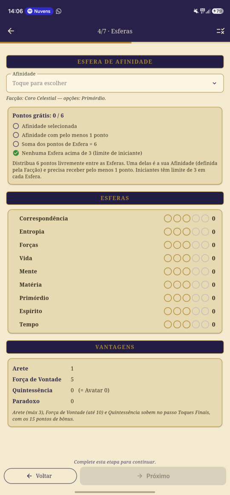</td>
<td>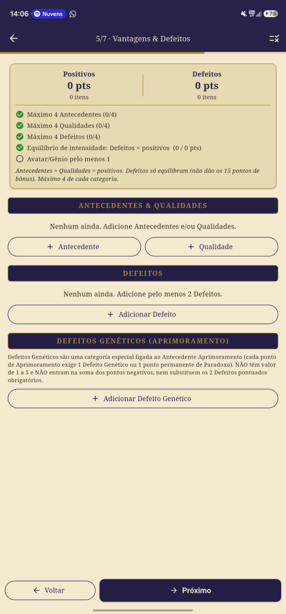</td>
</tr>

<tr>
<td valign="top">

**6 · Toques Finais**

Os **15 pontos de bônus**, com os custos do livro: Atributo 5 · Habilidade 2 ·
Esfera 7 · Arete 4 · Força de Vontade 1 · Quintessência 1 (= +4). É aqui que
uma Habilidade passa de 3 para 4 ou 5. Pode sobrar.

</td>
<td valign="top">

**⚙ Regras da ficha**

*Iniciante* cobra tudo. *Livre — evolução / mestre* transforma os limites em
avisos, para quando o personagem cresce jogando ou o narrador precisa ajustar.
A escolha fica gravada na ficha.

</td>
<td valign="top">

**7 · Detalhes**

História, objetivos, rotinas, focos, maravilhas, aparência, itens, combate e
outras características. Tudo opcional — salvar leva direto para a lista.

</td>
</tr>
<tr>
<td>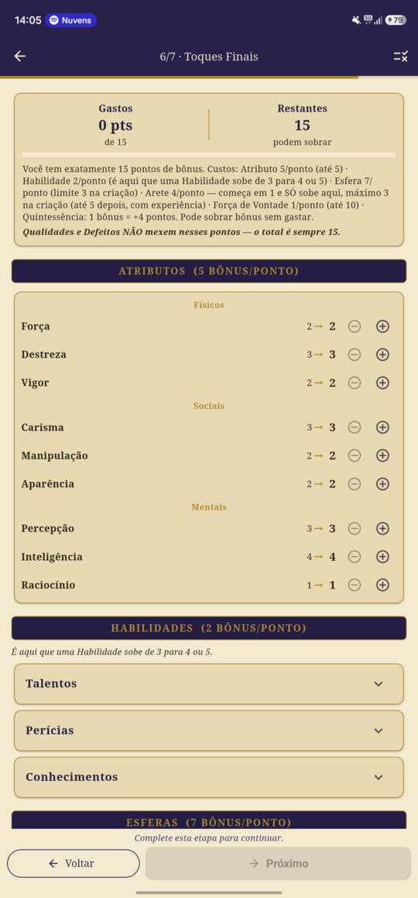</td>
<td>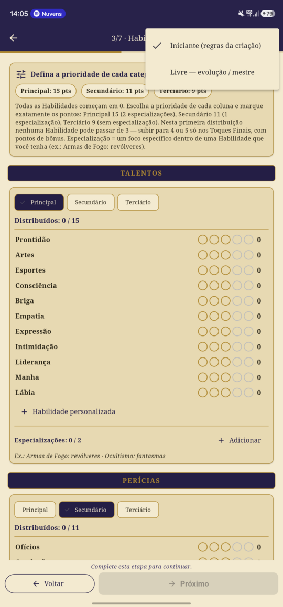</td>
<td>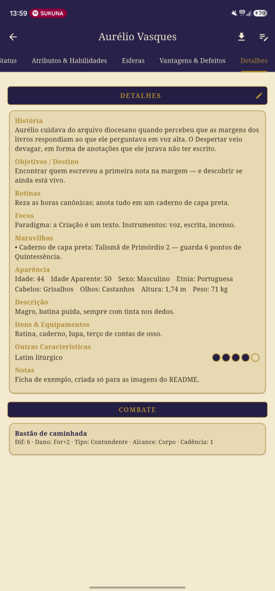</td>
</tr>
</table>

---

## Em jogo: a ficha em 6 abas

Terminada a criação, a ficha vira uma tela de consulta com **trackers que salvam
na hora** — sem botão de salvar, sem confirmação.

<table>
<tr>
<td width="33%" valign="top">

**Personagem**

Identidade completa, com a Facção resolvida (Afiliações sem subdivisão não
repetem o nome duas vezes).

</td>
<td width="33%" valign="top">

**Status**

Arete e Força de Vontade, roda de 20 espaços de Quintessência/Paradoxo,
Vitalidade com as penalidades e Experiência. Toque num nível de dano para
marcar; o ± ajusta na hora.

</td>
<td width="33%" valign="top">

**Atributos & Habilidades**

Valores finais (grátis + bônus) em bolinhas grandes, com a prioridade de cada
coluna e as especializações entre parênteses.

</td>
</tr>
<tr>
<td>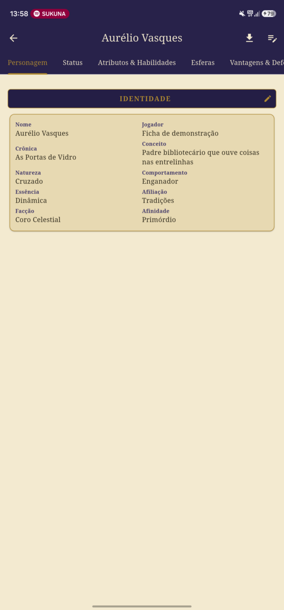</td>
<td>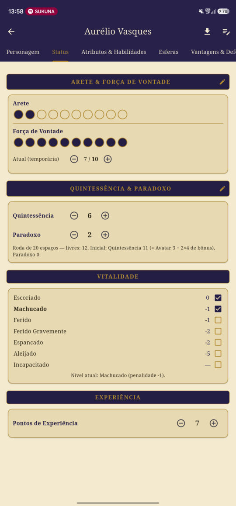</td>
<td>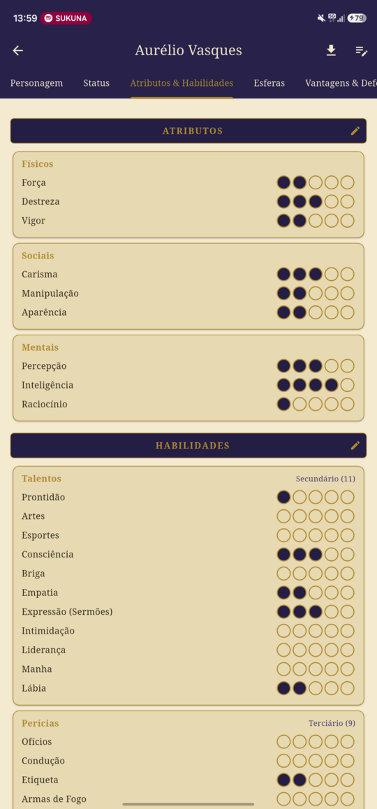</td>
</tr>

<tr>
<td valign="top">

**Esferas**

As 9 Esferas com a Afinidade marcada com ★.

</td>
<td valign="top">

**Vantagens & Defeitos**

Os detalhes que você escreveu aparecem entre parênteses, e o rodapé confere o
equilíbrio: positivos = Defeitos.

</td>
<td valign="top">

**Editar por seção**

O lápis ✎ em cada faixa abre **só aquele pedaço** do wizard. O ✎ da barra abre a
ficha inteira com abas no topo.

</td>
</tr>
<tr>
<td>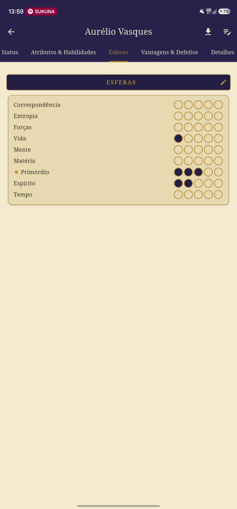</td>
<td>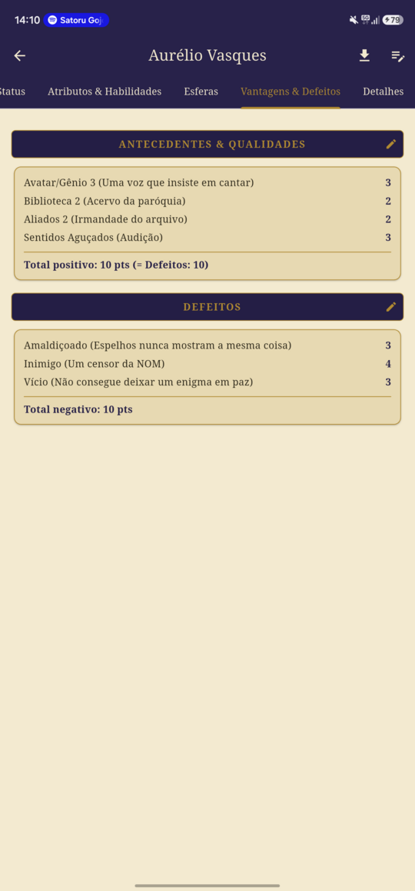</td>
<td>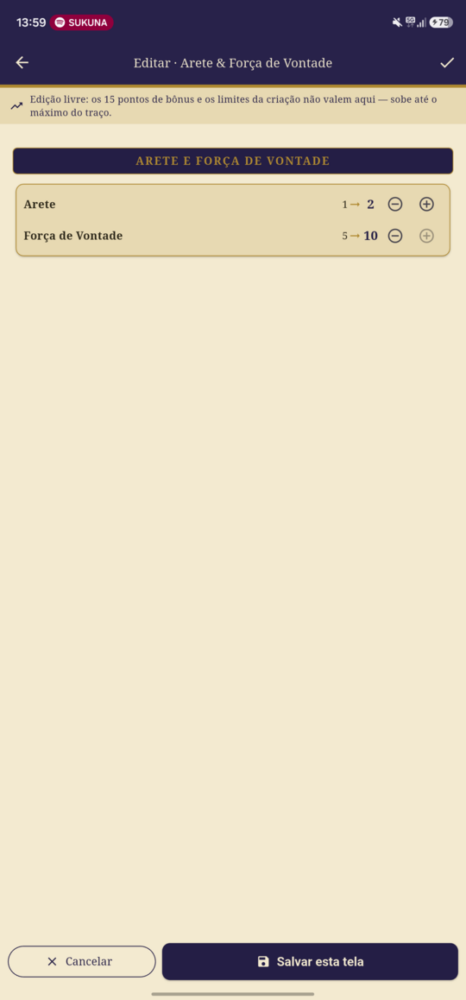</td>
</tr>
</table>

### Editar por seção, de verdade

Essa última tela merece um parágrafo. Clicar no ✎ de *Arete & Força de Vontade*
abre **exatamente esses dois campos** — não o passo inteiro de Toques Finais com
mais quarenta linhas. E como os **15 pontos de bônus são regra da criação**, eles
não aparecem aqui: quem já jogou pode subir até o máximo do traço sem pedir
licença a um orçamento que acabou faz tempo.

O mesmo vale para as outras faixas: *Quintessência & Paradoxo* abre só a
Quintessência, *Defeitos* abre só os Defeitos. É o `WizardScreen` recortado por
etapa **e** por sub-seção.

---

## Download da ficha oficial em PDF

O botão ⬇ gera um PDF **idêntico à ficha oficial de duas páginas** da edição 20º
aniversário, com todos os valores preenchidos por cima.

Como funciona: as duas páginas foram rasterizadas a 150 dpi
(`assets/ficha/pg-*.png`) e a coordenada de **cada campo e cada bolinha** foi
calibrada por análise de imagem, indo parar em `assets/ficha/overlay.json`. O
`lib/services/ficha_pdf.dart` desenha o overlay e monta o A4 final. Na web o
download sai direto pelo navegador.

**Nada se perde.** História grande, listas longas e traços acima de 5 não cabem
na ficha impressa — o que sobra vai para **páginas de anexo** no fim do PDF, e o
lugar do corte fica marcado com "(continua no anexo)". O retrato do personagem
também sai ali, já que a ficha oficial não tem espaço para foto. Ficha pequena
continua com as duas páginas de sempre.

---

## Área do narrador

Uma segunda aba, do lado da lista de magos:

- **Galeria** — cards com retrato, no estilo de um board: filtra por jogador ou
  NPC, busca por nome e ordena por qualquer característica.
- **Campos customizados** — o narrador cria os campos que quiser (texto, número
  ou etiqueta). Os do tipo *lido da ficha* (Arete, Afiliação, Vitalidade…) não
  são preenchidos à mão: servem para ordenar e filtrar direto pelos valores que
  já estão na ficha. Os demais são preenchidos na própria ficha, na aba
  Personagem — vale para jogadores e NPCs.
- **Jogador ou NPC** — a ficha tem o campo na aba Personagem e troca a qualquer
  momento. Importante para JSON antigo: arquivo exportado antes desse campo
  existir chega como jogador, e o import pergunta (ou marca o lote inteiro como
  NPC de uma vez).
- **NPCs** — o botão ➕ abre o **mesmo passo a passo do personagem de jogador**,
  só que em modo livre: nenhum limite trava o narrador (Esferas até 10, sem
  cobrar os 6 pontos nem os 15 bônus). NPC é uma `Ficha` normal com um selo, e
  abre na ficha completa, com trackers e PDF, igual a dos jogadores.
- **Cadernos** — anotações com imagens, tags e personagens ligados. A imagem
  **abre em tela cheia** com zoom e deslizar entre elas, cada uma com legenda, e
  tem um **modo mostrar** que apaga toda a interface: fundo preto e só a imagem,
  para virar o celular na direção da mesa. A nota da sessão de hoje fica fixada
  no topo, e as tags viram filtros de um toque.

## Backup de tudo em um arquivo

O menu ⋮ exporta um `.zip` com todas as fichas, os NPCs, os cadernos, as imagens
e os campos do narrador. Cada ficha vira um `.json` dentro de `fichas/` no mesmo
formato do export individual — dá para pescar um personagem só do zip e importar
sozinho.

Na importação o app mostra o resumo **antes de gravar** e, quando alguma ficha já
existe no aparelho, pergunta o que fazer: duplicar, substituir ou pular.

---

## Mesa online (opcional)

O app é offline e continua sendo. A mesa é um extra que só existe enquanto
alguém quer: sem entrar em mesa nenhuma, nada de rede acontece — criar ficha,
PDF e backup funcionam em modo avião do mesmo jeito.

**Como funciona numa sessão.** O mestre cria a mesa e dita um código de seis
caracteres (`MAGO-XXXX`). Quem entra vira jogador e aparece na lista, com uma
bolinha que fica cinza depois de 90 segundos sem sinal.

O jogador escolhe **publicar uma ficha**. A partir daí, o que ele marca —
dano, Força de Vontade, Quintessência, Paradoxo, experiência — chega ao mestre
em segundos. As escritas são agrupadas numa janela de 2s: marcar dano salva a
ficha a cada toque, e mandar toque a toque seria uma escrita por toque.

**O mestre só olha.** A ficha publicada abre para ele sem lápis e com os `+`/`−`
mortos; a única exceção é baixar o PDF, que não escreve nada. Quem garante isso
não é a tela, é a regra do Firestore: só o dono escreve na própria ficha. As
fichas da sessão aparecem também na galeria do narrador, marcadas como
`na mesa · só leitura`.

**Um jogador não vê a ficha do outro.** Só o dono e o mestre.

**Mural.** O mestre escolhe uma imagem e ela abre em tela cheia no aparelho de
todo mundo na mesa, com o mesmo modo mostrar do caderno. A imagem vai em base64
dentro do documento — sem Firebase Storage, que hoje exige plano pago —, então o
app reduz até caber com folga no limite de 1 MiB por documento.

**Sair volta tudo ao normal.** Tirar a ficha da mesa, sair ou o mestre fechar a
mesa: as cópias na nuvem somem e a ficha local continua com tudo que foi marcado
durante a sessão.

O roteiro de verificação manual — o que não dá para testar sem dois aparelhos de
verdade — está em [`docs/mesa-verificacao-manual.md`](docs/mesa-verificacao-manual.md).

---

## No celular e no PC

A mesma build serve os dois: em tela estreita a navegação fica embaixo, e a
partir de 900px ela vira barra lateral e o conteúdo para de esticar de ponta a
ponta — ler uma ficha atravessando um monitor de 27" é desconfortável.

No iPhone, a página declara `viewport` com `viewport-fit=cover`: sem isso o
Safari desenha tudo como se a tela tivesse 980px e encolhe o app inteiro.

## Instalar

### Dois canais no mesmo aparelho

A partir da branch `mesa-online` o app tem dois canais, assinados com a mesma
chave e com ids diferentes — dá para ter os dois instalados lado a lado:

```bash
flutter build apk --release --flavor estavel   # com.kodem.mago_a_ascensao        "Mago: A Ascensão"
flutter build apk --release --flavor beta      # com.kodem.mago_a_ascensao.beta   "Mago (teste)"
```

O canal `beta` existe para testar mudanças grandes sem tocar na ficha que está
em uso na mesa. Cada canal atualiza por cima de si mesmo; um nunca desinstala o
outro. Com os canais definidos, `flutter build apk` sem `--flavor` não funciona
mais — é preciso dizer qual.

### Android

Baixe o APK em [Releases](../../releases) e instale (precisa liberar "fontes
desconhecidas"). O app é assinado com chave de debug, então o Play Protect vai
pedir confirmação.

### iPhone / iPad / qualquer navegador

Abra **<https://gabesilvadev.github.io/mago-ficha/>** no Safari → botão
Compartilhar → **Adicionar à Tela de Início**. Vira ícone, roda em tela cheia e
funciona offline depois do primeiro carregamento.

> **Faça backup.** No iOS o Safari pode descartar os dados de um site após
> ~7 dias sem uso. Adicionar à Tela de Início reduz bastante o risco, mas o
> seguro é o **Exportar JSON** (menu ⋮ do card da ficha) de vez em quando — o
> mesmo arquivo importa em qualquer aparelho, inclusive no Android.

---

## Como foi feito

### Arquitetura

```
lib/
├── data/game_data.dart        # carrega e indexa os assets/data/*.json
├── models/
│   ├── ficha.dart             # a ficha é um Map<String, dynamic> com getters defensivos
│   ├── campo_narrador.dart    # definição dos campos customizados
│   └── nota.dart              # caderno de anotação
├── store/                     # persistência local (Hive), uma box por assunto
│   ├── ficha_store.dart       # fichas (jogadores e NPCs)
│   ├── imagem_store.dart      # imagens reduzidas (retratos e cadernos)
│   ├── narrador_store.dart    # config do narrador
│   └── nota_store.dart        # cadernos
├── screens/
│   ├── home_screen.dart       # abas Magos / Narrador, importar e exportar
│   ├── wizard_screen.dart     # os 7 passos — criação E edição
│   ├── ficha_view_screen.dart # as 6 abas + trackers de jogo
│   └── narrador/              # galeria, cadernos e campos customizados
├── services/
│   ├── ficha_io.dart          # export/import .json
│   ├── backup_io.dart         # backup .zip de tudo
│   └── ficha_pdf.dart         # overlay sobre a ficha oficial + anexo
└── widgets/
    ├── dots.dart              # as bolinhas clicáveis
    └── retrato.dart           # retrato circular e seletor de imagem
```

**As regras não estão no código.** Custos, limites, listas de Antecedentes,
Qualidades, Defeitos, Naturezas, Esferas, bloqueios por Facção — tudo vive em
`assets/data/*.json`, carregado na inicialização. Ajustar uma regra de mesa é
editar um JSON, não recompilar lógica.

**Uma tela para criar e editar.** O `WizardScreen` recebe três eixos
independentes:

| Parâmetro | O que faz |
|---|---|
| `existente` | `null` cria uma ficha nova; uma `Ficha` entra em modo edição |
| `passos` | quais das 7 etapas entram nesta sessão (`[5]` = só Toques Finais) |
| `secoes` | quais sub-blocos da etapa aparecem (`{'arete','forcaVontade'}`) |

Disso saem os três comportamentos: criação sequencial travada, edição completa
com abas no topo, e edição cirúrgica de uma faixa só. Sem três telas duplicadas.

**Ficha tolerante a versão.** O modelo guarda um `Map` e todo acesso passa por
getter com valor padrão. Uma ficha exportada numa versão antiga importa numa
nova sem migração: os campos que não existiam simplesmente nascem com o padrão.

### Decisões que mudaram no caminho

- **Os limites da criação não podem sobreviver à criação.** A primeira versão
  respeitava o modo gravado na ficha ao editar — resultado: quem tinha marcado
  *Iniciante* durante a criação não conseguia subir Arete depois, porque os 15
  pontos de bônus já estavam gastos. Hoje editar uma ficha pronta **sempre** entra
  livre. Os 15 pontos existem só no wizard de criação.
- **Editar uma seção é editar uma seção.** Antes, o ✎ de *Arete & Força de
  Vontade* abria o passo inteiro de Toques Finais. Virou o parâmetro `secoes`.
- **Placar de regra some na edição.** Card de distribuição, checklist de Esferas,
  equilíbrio de Vantagens, orçamento dos 15 — todos escondidos quando não há mais
  regra a cobrar. Menos ruído para quem só quer ajustar um valor.

### Verificar

```bash
docker compose up -d
docker compose exec flutter flutter pub get
docker compose exec flutter flutter analyze     # sem warnings
docker compose exec flutter flutter test        # 30 testes
```

Os testes cobrem as regras de criação (distribuição, orçamentos, equilíbrio,
custos de bônus), o recorte por `passos`/`secoes`, o modo livre, a geração do
PDF e o layout das 7 telas num viewport de celular.

### Rodar

```bash
# web, com hot reload, em http://localhost:8092
docker compose exec flutter flutter run -d web-server \
  --web-hostname 0.0.0.0 --web-port 8092

# APK release
docker compose exec flutter flutter build apk --release
```

O CI (`.github/workflows/pages.yml`) roda `analyze` + `test` a cada push e só
publica o PWA se os dois passarem.

---

## Ficha de exemplo

As imagens deste README usam
[`docs/ficha-demo.json`](docs/ficha-demo.json) — um personagem fictício montado
para fechar todas as regras de criação (4-3-3-3-2-2-2-2-1 · 15/11/9 · 6 pontos
de Esfera · positivos 10 = Defeitos 10 · 15 bônus gastos). Importe pelo menu ⋮ da
lista se quiser explorar o app com uma ficha pronta.

---

## Stack

Flutter · Hive (armazenamento local) · pdf + printing (geração do PDF) ·
share_plus e file_picker (export/import) · archive (backup .zip) ·
image (redimensiona os retratos) · Docker para o ambiente de build ·
GitHub Actions para CI e publicação.

---

## Aviso legal

Projeto pessoal, sem fins lucrativos e sem vínculo com a editora. *Mago: A
Ascensão*, o Mundo das Trevas e a ficha oficial reproduzida em `assets/ficha/`
são propriedade da Paradox Interactive / White Wolf. Os textos de regra em
`assets/data/` existem só para o app conseguir cobrar a criação e não substituem
o livro — compre o livro.

O código é meu; o material do cenário, não.
